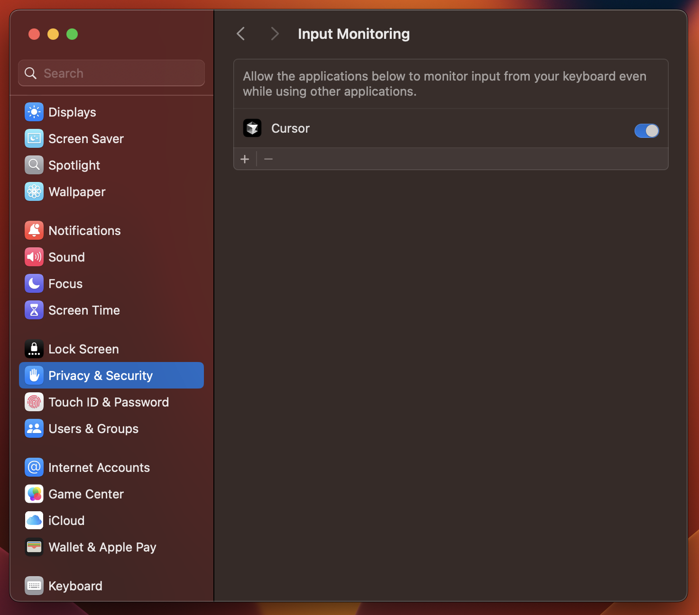
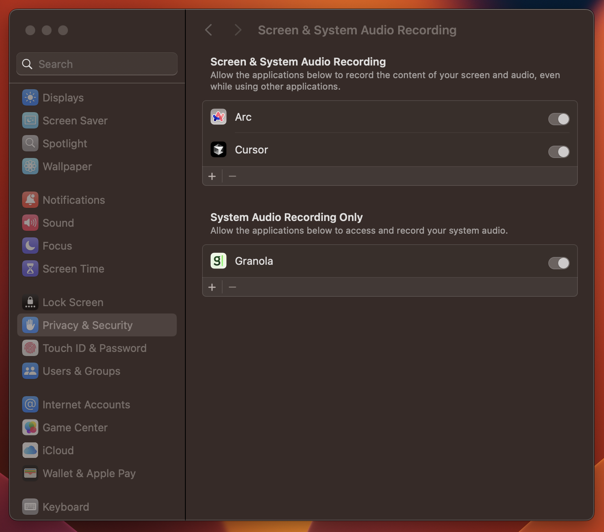
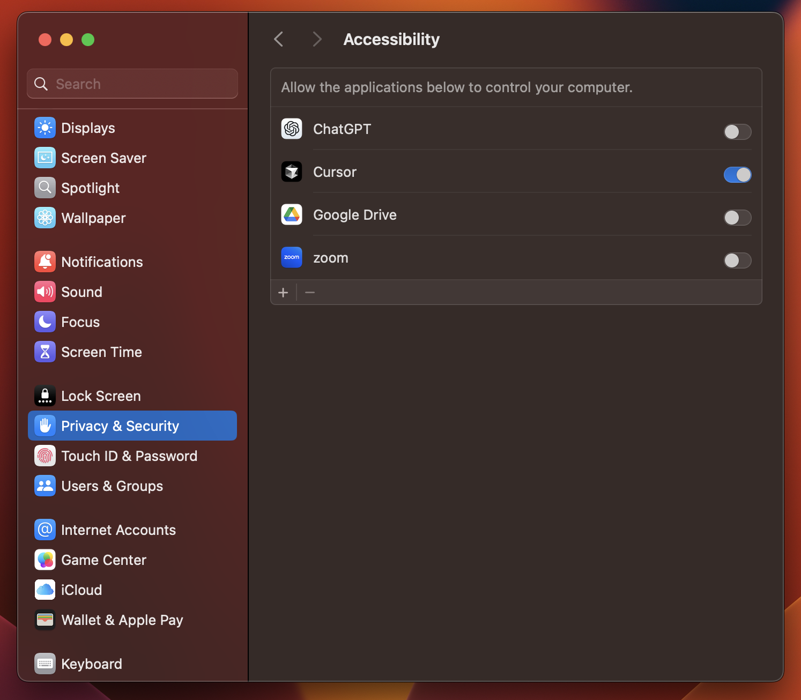

# SAMMY Actuator API

A FastAPI-based actuator service that enables SAMMY extension automation and screen capture.

## Prerequisites

- Python 3.12
- Poetry (Python package manager)
- Chrome/Arc browser for extension support

## Installation

1. **Clone the repository**

   ```bash
   git clone https://github.com/SammyClub/sammy-actuator
   cd sammy-actuator
   ```

2. **Install Poetry** (if not already installed)

   ```bash
   # On Unix/macOS/WSL
   curl -sSL https://install.python-poetry.org | python3 -
   ```

3. **Install dependencies**
   ```bash
   poetry env use 3.12
   poetry install
   ```

# Setting permissions in macOS

If using macOS, you'll need to set up some permissions to ensure that the extension works as intended. Note that you won't be prompted for accessibility permissions. If permission is not granted, actuating will silently fail.

## Enabling input monitoring

Input monitoring must be enabled in Settings in order to allow capture of mouse and keyboard input. You can do so by enabling the Cursor (or your IDE) under Settings &#8594; Privacy and security &#8594; Input monitoring &#8594; Allow Cursor (or your IDE)



## Enabling screen recording

Screen recoding must be enabled in Settings in order to allow capture of screenshots. You can do so by enabling the Cursor (or your IDE) application under Settings &#8594; Privacy and security &#8594; Screen recording &#8594; Allow Cursor (or your IDE)



## Enabling replay of actions

Mouse and keyboard control must be enabled in Settings in order to allow replay of actions by the framework. You can do so by enabling the Cursor (or your IDE) application under Settings &#8594; Privay and security &#8594; Accessibility &#8594; Allow Cursor (or your IDE)



## Running the API

### Development Mode

```bash
poetry run uvicorn actuator.app:app --port 8001 --reload
```

### Production Mode

```bash
poetry run gunicorn actuator.app:app -c gunicorn.conf.py
```

## Browser Extension Setup

1. Open your browser's extensions page:

   - Chrome: Navigate to `chrome://extensions`
   - Arc: Navigate to `arc://extensions`

2. Enable "Developer mode" (toggle in the top-right corner)

3. Click "Load unpacked"

4. Navigate to and select the `supabase-extension` folder in this repository
